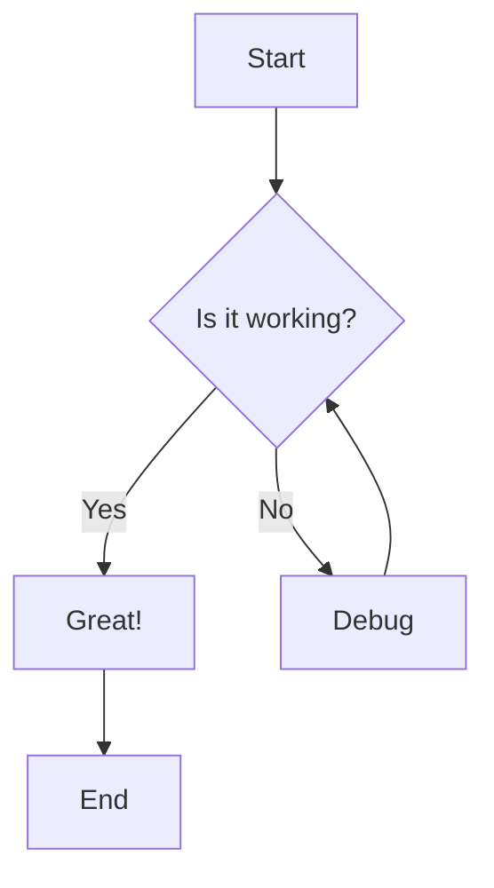
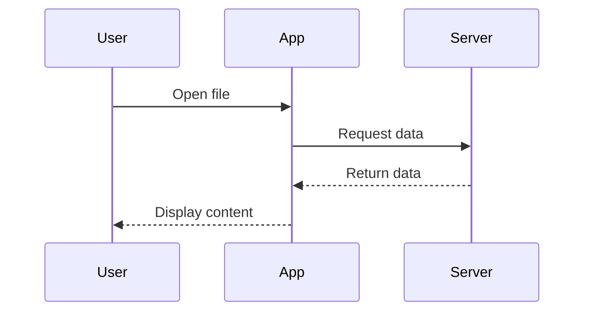

# Test Document for lucidVIEW

<!--category-- Testing, Mermaid, Code -->
<datetime class="hidden">2026-01-12T14:00</datetime>

This document tests various markdown features.

## Code Blocks

### C# Code

```csharp
public class HelloWorld
{
    public static void Main(string[] args)
    {
        Console.WriteLine("Hello, World!");

        var numbers = new[] { 1, 2, 3, 4, 5 };
        foreach (var n in numbers)
        {
            Console.WriteLine($"Number: {n}");
        }
    }
}
```

### JavaScript Code

```javascript
function greet(name) {
    return `Hello, ${name}!`;
}

const users = ['Alice', 'Bob', 'Charlie'];
users.forEach(user => console.log(greet(user)));
```

### Python Code

```python
def fibonacci(n):
    if n <= 1:
        return n
    return fibonacci(n-1) + fibonacci(n-2)

for i in range(10):
    print(f"fib({i}) = {fibonacci(i)}")
```

## Mermaid Diagrams

### Flowchart



### Sequence Diagram



## Other Features

### Blockquote

> This is a blockquote.
> It can span multiple lines.

### Table

| Feature | Status |
|---------|--------|
| Code blocks | Testing |
| Mermaid | Testing |
| Tables | Working |

### Lists

- Item 1
- Item 2
  - Nested item
  - Another nested
- Item 3

---

*End of test document*
